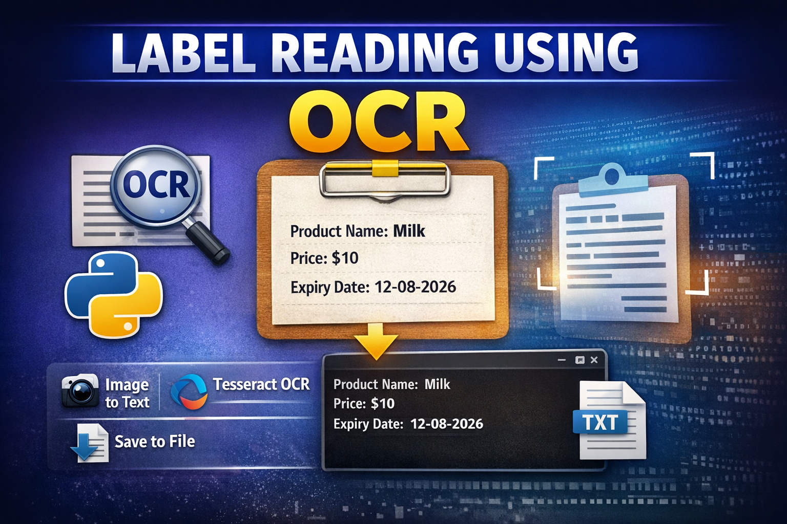

<p align="center">
  
</p>

# 🧾 Label Reading Using OCR (Python)


## 📌 Project Overview

This project demonstrates **Optical Character Recognition (OCR)** using **Python and Tesseract OCR Engine**.
The system reads text from images (such as product labels or printed text) and converts it into machine-readable text.

The extracted text is displayed in the terminal and also saved into a file for further use.

This project is useful for applications like:

* Product label reading
* Invoice digitization
* Document scanning
* Automated text extraction
* Smart inventory systems

---

# ⚙️ Technologies Used

* **Python**
* **Tesseract OCR**
* **Pillow (PIL)**
* **OpenCV (optional for preprocessing)**
* **NumPy**

---

# 📂 Project Structure

```
label-reading-ocr
│
├──
│   └── test_images
│       ├── test1.jpg
│       
│      
│
├── 
│   └── ocr_label_reader.py
│
├── output
│   └── results.txt
│
├── requirements.txt
└── README.md
```

---

# 🚀 Installation

## 1️⃣ Clone the Repository

```bash
git clone https://github.com/selvan-01/label-reading-ocr.git
cd label-reading-ocr
```

---

## 2️⃣ Install Python Libraries

```bash
pip install -r requirements.txt
```

---

## 3️⃣ Install Tesseract OCR

Download Tesseract OCR from:

https://github.com/tesseract-ocr/tesseract

Install it on your system.

Default Windows installation path:

```
C:\Program Files\Tesseract-OCR\tesseract.exe
```

---

## 4️⃣ Configure Tesseract Path

Inside the Python script:

```python
pytesseract.pytesseract.tesseract_cmd = r"C:\Program Files\Tesseract-OCR\tesseract.exe"
```

---

# ▶️ How to Run the Project

Run the following command:

```bash
python src/ocr_label_reader.py
```

---

# 📸 Example Input

An image containing printed text or labels.

Example:

```
TEST IMAGE
-----------
Product Name: Milk
Price: $10
Expiry Date: 12-08-2026
```

---

# 📄 Example Output

```
Product Name: Milk
Price: $10
Expiry Date: 12-08-2026
```

The extracted text will also be saved inside:

```
output/results.txt
```

---

# 🔎 How It Works

1. The program loads the image using **Pillow**
2. The image is passed to **Tesseract OCR**
3. Tesseract processes the image and extracts text
4. The text is printed in the terminal
5. The text is saved into a file

---

# 🧠 Future Improvements

* Add **image preprocessing using OpenCV**
* Support **multiple image inputs**
* Create a **GUI application**
* Add **real-time OCR using webcam**
* Improve OCR accuracy using image enhancement

---

# 📦 Requirements

```
pytesseract
Pillow
opencv-python
numpy
```

Install using:

```bash
pip install -r requirements.txt
```

---
## 🔗 Links

- 💼 [LinkedIn](https://www.linkedin.com/in/senthamil45)
- 🌍 [Portfolio](https://senthamill.vercel.app/)
- 💻 [GitHub](https://github.com/selvan-01/label-reading-ocr.git)

# 👨‍💻 Author

**S. Senthamil Selvan**

Final Year – Computer Science Engineering
AI | Computer Vision | OCR

---

# ⭐ Support

If you like this project, please ⭐ the repository on GitHub.

---
